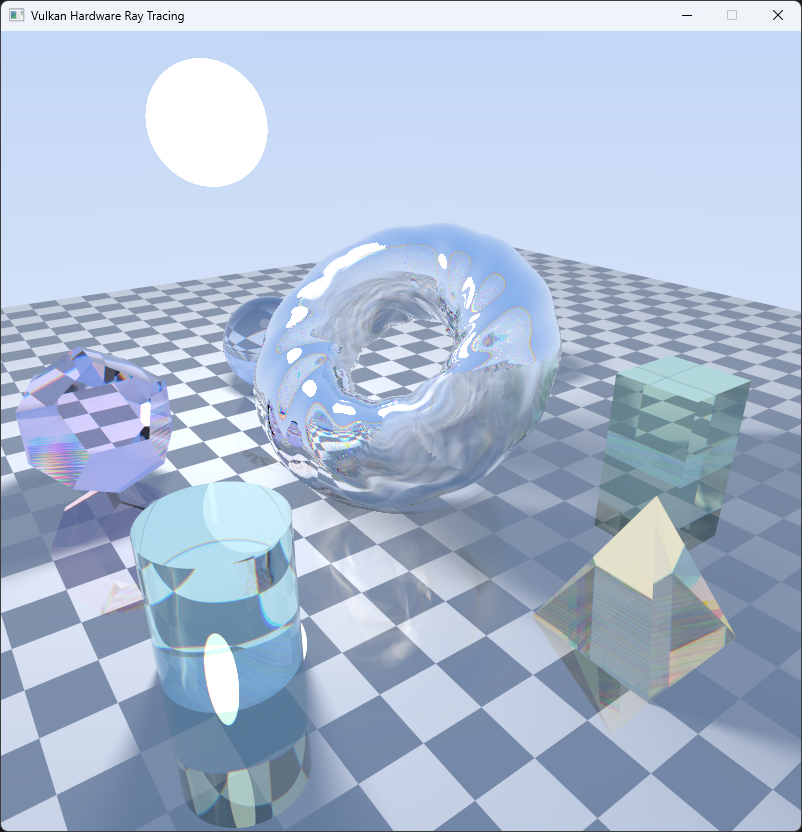

# Vulkan Hardware Path Tracing

[](https://github.com/sponsors/makarov-mm)
[](LICENSE)

[](https://www.linkedin.com/in/makarov-mm/)
[](https://www.threads.net/@m.m.makarov)
[](https://www.instagram.com/m.m.makarov/)


A real-time, hardware-accelerated Monte Carlo path tracer built on the Vulkan ray
tracing pipeline (`VK_KHR_ray_tracing_pipeline`). It runs on the GPU's dedicated RT
cores using acceleration structures, a ray-gen / closest-hit / miss shader pipeline
and a shader binding table, and solves the full rendering equation with unbiased
path tracing: global illumination, next event estimation with multiple importance
sampling, and Russian roulette. This is genuine hardware ray tracing, not a
compute-shader software tracer.

Zero external dependencies beyond the Vulkan SDK itself: the window is created
with raw Win32 (no GLFW) and all math is inline (no GLM).



## Features

- **Hardware ray tracing** — BLAS + TLAS, a full RT pipeline (ray generation,
  closest-hit and two miss shaders) and a correctly aligned shader binding table.
  Paths are traced iteratively from the ray-gen shader, so
  `maxPipelineRayRecursionDepth = 1`, which every RT-capable GPU supports.
- **Monte Carlo path tracing with global illumination** — diffuse surfaces bounce
  with cosine-weighted importance sampling, so indirect light and colour bleeding
  come out of the estimator naturally instead of being faked with an ambient term.
  The sky acts as an environment light collected by the paths themselves.
- **Next event estimation + multiple importance sampling** — every diffuse vertex
  casts one shadow ray toward the spherical area light, sampled uniformly over the
  solid angle it subtends. Light sampling and BSDF sampling are combined with the
  power heuristic, so the estimate stays low-noise whether the light is small and
  distant or large and close, and specular paths still pick up the light directly.
- **Russian roulette + firefly clamping** — long paths terminate stochastically
  without bias, and a per-sample radiance clamp suppresses the rare bright
  outliers so the image converges visibly faster.
- **SVGF-style a-trous denoiser** — after the ray tracing pass, a compute shader
  runs four iterations of an edge-avoiding a-trous wavelet filter guided by the
  primary hit's normal and depth. The radiance is demodulated by the primary-hit
  albedo before filtering and remodulated after, so the checkerboard and object
  colours stay pixel-sharp while the noisy lighting gets smoothed. The filter
  strength adapts to the per-pixel sample count (shrinking like the Monte Carlo
  standard error, 1/sqrt(n)), so it is strong on fresh noisy pixels during motion
  and fades out as the temporal accumulation converges. Glass pixels are marked
  as delta-specular in the guide and pass through unfiltered — smoothing the
  radiance behind a refractive surface would only frost the glass. Press `D` to
  toggle the denoiser and compare against the raw path-traced output.
- **Temporal accumulation + anti-aliasing** — each frame casts several jittered
  samples per pixel and blends the result into an `R32G32B32A32_SFLOAT` HDR
  accumulation buffer. While the camera is still the image progressively refines
  to a clean result; it resets the moment the camera moves. The per-pixel motion
  test tracks the primary hit position, and for glass pixels additionally a
  delta-chain signature (the deterministic path length through the refractive
  chain), so content moving behind or inside glass resets the history too
  instead of smearing into ghosts.
- **Soft shadows from an area light** — the scene is lit by a spherical area
  light (a visible emissive sphere). Because the light has real area, the penumbra
  widens with the occluder's distance, like real soft shadows.
- **Glass with chromatic dispersion** — dielectric glass with stochastic
  Fresnel-weighted reflection and refraction (Schlick) and total internal
  reflection. Refraction uses a different IOR per colour channel via spectral
  (hero-wavelength) sampling, so the glass splits light into faint rainbow edges,
  and the path tracer produces refractive caustics under the glass shapes as the
  accumulation converges.
- **ACES filmic tone mapping** — the accumulation buffer holds unclamped HDR
  radiance; the display image is tone-mapped with the ACES fit and gamma-corrected,
  so the emissive light and bright highlights roll off instead of clipping.

The scene is a glossy checkerboard floor, a central morphing glass supertoroid and
a ring of six coloured glass shapes, lit by a spherical area light that is itself
visible in the scene, in reflections and through the glass.

## Controls

| Input            | Action                          |
|------------------|---------------------------------|
| Left mouse drag  | Orbit the camera                |
| Mouse wheel      | Zoom in / out                   |
| D                | Toggle the denoiser on / off    |
| Esc              | Quit                            |

Hold still for a moment and watch the image converge — that is the accumulation
buffer averaging samples and cleaning up the soft-shadow and glass noise.

## Requirements

- Windows 10/11, x64.
- Visual Studio 2022 (toolset v143). The free Community edition is fine.
- [Vulkan SDK](https://vulkan.lunarg.com/) installed (sets the `VULKAN_SDK`
  environment variable, which the project uses for include/lib paths and the
  shader compiler).
- A ray-tracing capable GPU with current drivers:
  NVIDIA RTX 20-series or newer, AMD RX 6000-series or newer, or Intel Arc.

## Build & run

1. Open `VulkanRayTracing.sln` in Visual Studio 2022.
2. Select the `x64` platform (`Debug` or `Release`).
3. Build and run (F5).

The shaders are compiled to SPIR-V automatically by a pre-build step
(`compile_shaders.bat`) and copied next to the executable. You can also run that
batch file by hand at any time.

A console window shows the selected GPU and, in Debug builds, Vulkan validation
output.

## Project layout

```
VulkanRayTracing.sln
VulkanRayTracing.vcxproj
compile_shaders.bat          shader -> SPIR-V build step
src/main.cpp                 all host code (window, Vulkan, RT setup, render loop)
shaders/raygen.rgen          the path tracer: camera rays, cosine-weighted GI,
                             NEE + MIS, Russian roulette, glass with dispersion,
                             accumulation, ACES tone map
shaders/closesthit.rchit     vertex fetch + barycentric interpolation -> surface payload
shaders/miss.rmiss           primary miss (escaped ray -> sky)
shaders/shadow.rmiss         shadow miss (point is lit)
shaders/atrous.comp          SVGF-style edge-avoiding a-trous denoiser (compute)
```

## Notes

- The window is a fixed 1280x720 and non-resizable, which keeps the swapchain
  logic minimal and the code easy to read.
- Vulkan clip space has Y pointing down, handled by a negative `m[5]` in
  `perspectiveVk`. If the image ever shows up vertically flipped on your driver,
  flip the sign of that one term and rebuild.
- The displayed image is an `R8G8B8A8_UNORM` storage image (matching the `rgba8`
  shader qualifier) copied to the swapchain with `vkCmdBlitImage`, which maps
  colour components by name, so colours stay correct whether the swapchain is
  RGBA or BGRA.
- Quality / look knobs: `shaders/raygen.rgen` holds the per-channel `IOR_R/G/B`
  (widen the spread for stronger dispersion) and `FIREFLY_CLAMP` (raise it for a
  more exact but noisier result). `updateUniforms` on the host sets the light
  position, the light radius (`lightPos[3]` — bigger = softer shadows),
  `params[1]` the maximum path length, `params[2]` the light emission strength
  (HDR radiance, tone-mapped on output), and `params[3]` the number of samples
  cast per frame (raise it for smoother motion, lower it for more speed on
  weaker GPUs).
- The emissive sphere's albedo in `initScene` doubles as the light colour used by
  next event estimation in the shader; keep the two in sync if you change it.
- Denoiser knobs: `shaders/atrous.comp` holds the edge-stopping tolerances
  (`sigN`, `sigZ`, `sigL`); the iteration count and step sequence live in the
  denoise block of `drawFrame` in `src/main.cpp`. Because the display path is
  identical either way (ACES + gamma), the `D` toggle is a fair A/B comparison.
- Caustics (light focused through the glass shapes onto the floor) reach the
  camera only via BSDF-sampled paths, so they are the slowest effect to converge —
  hold the camera still for a few seconds to see them resolve.

## License

MIT License

Copyright (c) 2026 Mykhailo Makarov

Permission is hereby granted, free of charge, to any person obtaining a copy
of this software and associated documentation files (the "Software"), to deal
in the Software without restriction, including without limitation the rights
to use, copy, modify, merge, publish, distribute, sublicense, and/or sell
copies of the Software, and to permit persons to whom the Software is
furnished to do so, subject to the following conditions:

The above copyright notice and this permission notice shall be included in all
copies or substantial portions of the Software.

THE SOFTWARE IS PROVIDED "AS IS", WITHOUT WARRANTY OF ANY KIND, EXPRESS OR
IMPLIED, INCLUDING BUT NOT LIMITED TO THE WARRANTIES OF MERCHANTABILITY,
FITNESS FOR A PARTICULAR PURPOSE AND NONINFRINGEMENT. IN NO EVENT SHALL THE
AUTHORS OR COPYRIGHT HOLDERS BE LIABLE FOR ANY CLAIM, DAMAGES OR OTHER
LIABILITY, WHETHER IN AN ACTION OF CONTRACT, TORT OR OTHERWISE, ARISING FROM,
OUT OF OR IN CONNECTION WITH THE SOFTWARE OR THE USE OR OTHER DEALINGS IN THE
SOFTWARE.

## Support

If you found this project interesting or useful, you can support my work:

[](https://github.com/sponsors/makarov-mm)
